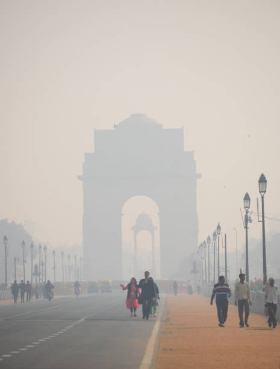

# AI Innovators Hub — Technical Team Screening Task (2025-26)

## Why this task exists

As we are all aware, Delhi has been consistently ranked among the most polluted capital cities in the world.   
[Source: https://www.iqair.com/in-en/world-most-polluted-cities]  
  
PM2.5 and PM10 exposure directly impacts lungs, cognitive performance and long-term public health. As an applied AI club, we want to focus on real-world issues.

This screening task is designed to evaluate if you can:

* work with real-world, slightly messy public datasets
* think clearly, scope a small Minimum Viable Product [MVP]  
* produce a working output in a limited time
* communicate your results cleanly

This is exactly the way we work inside AI Innovators Hub.

---

## Dataset

Use this public dataset on Kaggle:

**Air Quality Data in India (2015 - 2020)**
[https://www.kaggle.com/datasets/rohanrao/air-quality-data-in-india](https://www.kaggle.com/datasets/rohanrao/air-quality-data-in-india)

You will specifically work on the file:
`city_day.csv`

---

## Your Task

Use **Delhi data only** and choose **any one** of the two tasks below.

---

### OPTION 1 → Build a Predictor

Task: Predict tomorrow’s PM2.5 value in Delhi based on the previous data.

Minimum Requirements:

* Load & clean the Delhi subset
* Train a prediction model (can be sklearn or pre-trained ML model or even LLM toolchains like Gemini 2.5 Flash etc.)
* Produce a single prediction: **what is PM2.5 the next day after the final date in the data?**  
[The "next day" means: if data ends on 2020-07-01, predict 2020-07-02]
* Show your evaluation / reasoning

---

### OPTION 2 → Build a Simple Intelligent Dashboard / Insight

Task: Generate insights + a small dashboard on “What factor correlates most with PM2.5 in Delhi?”

Minimum Requirements:

* Load & clean the Delhi subset
* Find which pollutant has highest correlation with PM2.5 (or create a ranking)
* Produce an insight: “Which pollutant influences PM2.5 most?”
* Optional bonus: simple web dashboard (streamlit / gradio)

---

## Allowed

* pretrained models
* CSV data wrangling libraries
* any python libs

**Ethics Note:** Using AI tools is allowed, but your submission must reflect your thinking. If your code is fully autogenerated without understanding, we will immediately reject.

## Not Allowed

* submitting a notebook copy-pasted from Kaggle/YouTube/GitHub without any modification

**We will ask**: "Walk me through your code line-by-line" in the interview.
If you can't explain it, you will be disqualified.

---

## Deliverables (mandatory)

Submit a Google Drive or GitHub link with:

* your `.ipynb` notebook (Colab preferred)
* A small README:
  * Which option you selected (1 or 2)
  * What method/model you used
  * What your result was

File naming format (IMPORTANT):

`YourName_AIH_2025_Screening.ipynb`  
example: `Swayam_AIH_2025_Screening.ipynb`

**Important**: Your notebook should run from top to bottom without errors when we open it.

---

## Timeline

**Deadline:** 11:59PM, 18/11/2025 (IST)  
(If you are reading this after this date, you cannot submit.)

---

## Goal

We don’t expect perfection.

We expect:
* willingness to learn
* ability to complete end-to-end
* ability to explain what you did

Good luck. Build something real.
